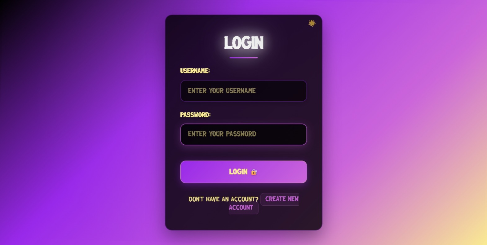
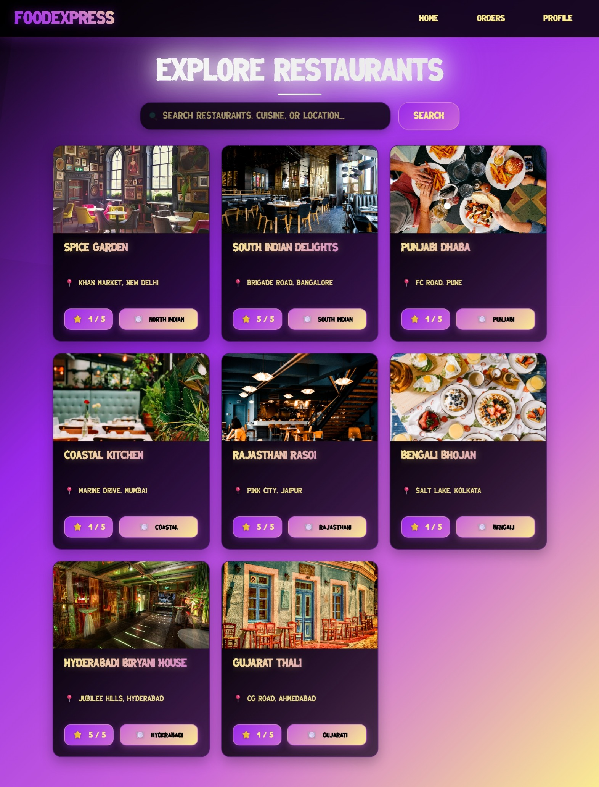
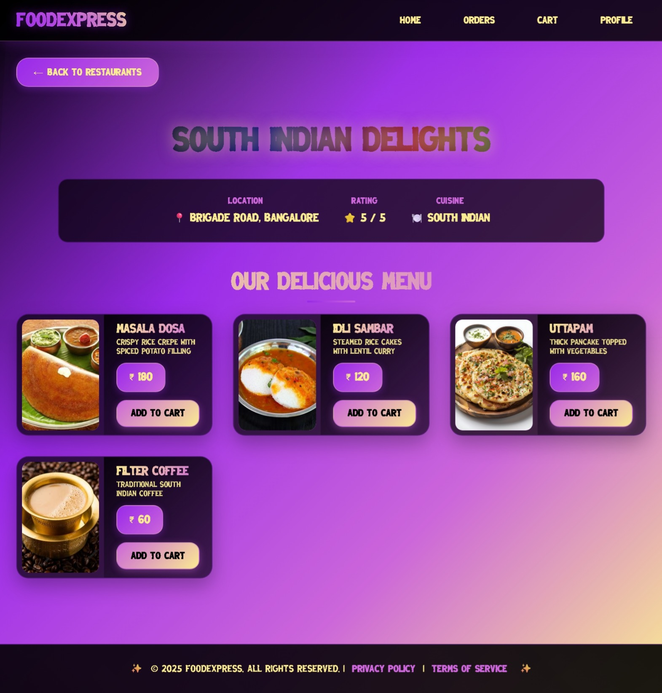
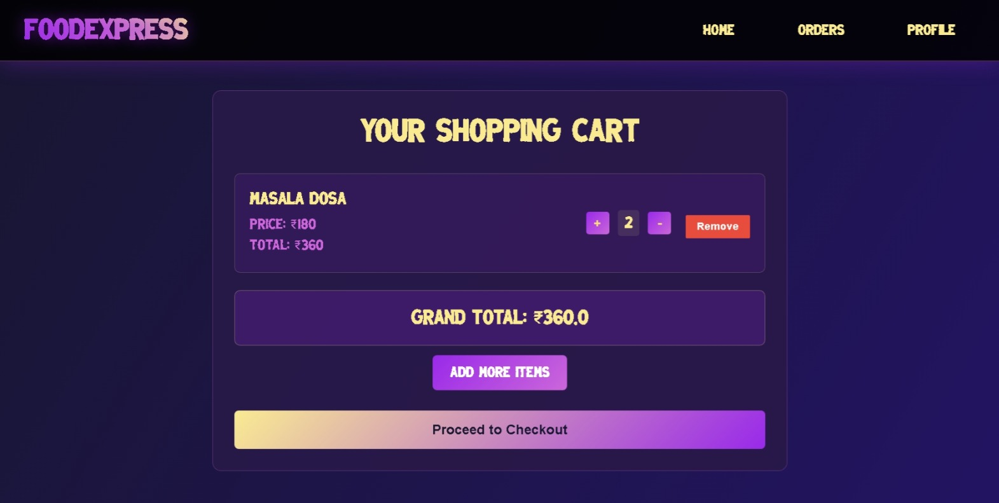
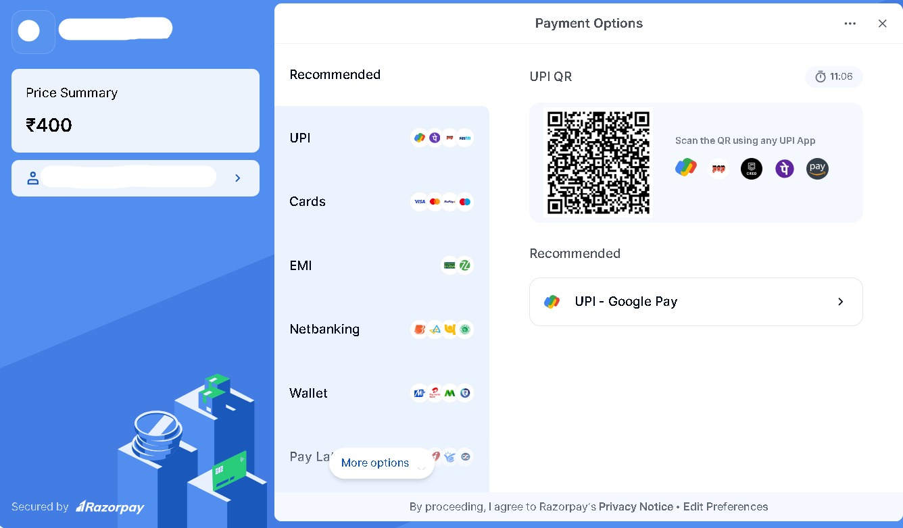

# FoodExpressWebApp 🍕

A comprehensive food delivery web application built using Java Enterprise Edition (JEE) technologies, providing a complete online food ordering experience with user management, restaurant browsing, cart functionality, and order processing.

## 📋 Project Overview

FoodExpressWebApp is a full-stack web application that enables users to browse restaurants, view menus, add items to cart, place orders, and track their order history. The application also provides administrative features for restaurant and menu management.

## 🛠️ Technologies Used

- **Backend**: Advanced Java, JEE (Java Enterprise Edition)
- **Database**: MySQL
- **Database Connectivity**: JDBC
- **Frontend**: JSP (JavaServer Pages), HTML, CSS
- **Architecture**: MVC (Model-View-Controller) Pattern
- **Server**: Java Servlet Container

## 🏗️ Project Structure

```
FoodExpressWebApp/
├── src/
│   └── main/
│       └── java/
│           └── com/
│               └── opsam/
│                   ├── Launch.java
│                   ├── models/          # Data Models
│                   ├── Dao/             # Data Access Object
│                   ├── DaoImpl/         # Data Access Object Implimentation 
│                   ├── servlets/        # Servlet Controllers
│                   │   └──              #All Servlet Classes Should be Here
│                   └── util/            # Utility Classes
│                       └──  DBConnection.java
│                     
└── webapp/
    ├── css/                           # Stylesheets
    ├── images/                        # Static Images
    │   ├── menu/
    │   └── restaurants/
    ├── META-INF/
    ├── WEB-INF/
    └── JSP Pages:
        ├── cart.jsp
        ├── checkout.jsp
        ├── login.jsp
        ├── menu.jsp
        ├── orders.jsp
        ├── ordersHistory.jsp
        ├── payment.jsp
        ├── profile.jsp
        ├── register.jsp
        └── restaurant.jsp
```

## ✨ Features

### User Features
- **User Registration & Authentication**: Secure user registration and login system
- **Restaurant Browsing**: View available restaurants with images and details
- **Menu Exploration**: Browse restaurant menus with item details and pricing
- **Shopping Cart**: Add/remove items, adjust quantities, view cart total
- **Order Placement**: Secure checkout process with order confirmation
- **Order History**: Track past orders and order status
- **User Profile**: Manage personal information and preferences
- **Payment Processing**: Integrated payment system

### Technical Features
- **MVC Architecture**: Clean separation of concerns
- **Database Integration**: MySQL database with JDBC connectivity
- **Session Management**: User session handling and security
- **Responsive Design**: CSS-styled responsive user interface
- **Data Validation**: Server-side and client-side validation
- **Error Handling**: Comprehensive error handling and user feedback

## 🗄️ Database Schema

The application uses MySQL database with the following main entities:
- **Users**: User account information
- **Restaurants**: Restaurant details and information
- **Menu**: Food items with pricing and descriptions
- **Cart**: User shopping cart items
- **Orders**: Order information and status
- **OrderItems**: Individual items within orders

## 🚀 Setup and Installation

### Prerequisites
- Java Development Kit (JDK) 8 or higher
- Apache Tomcat Server
- MySQL Database
- IDE (Eclipse/IntelliJ IDEA)

### Installation Steps

1. **Clone the Repository**
   ```bash
   git clone <repository-url>
   cd FoodExpressWebApp
   ```

2. **Database Setup**
   - Install and start MySQL server
   - Create a new database for the application
   - Import the database schema (SQL files should be provided)
   - Update database connection details in `DBConnection.java`

3. **Configure Database Connection**
   ```java
   // Update DBConnection.java with your database credentials
   private static final String URL = "jdbc:mysql://localhost:3306/foodexpress";
   private static final String USERNAME = "your_username";
   private static final String PASSWORD = "your_password";
   ```

4. **Deploy to Tomcat**
   - Copy the project to Tomcat's webapps directory
   - Start Tomcat server
   - Access the application at `http://localhost:8080/FoodExpressWebApp`

## 📱 Usage

1. **User Registration**: New users can register with email and personal details
2. **Login**: Existing users can login to access their accounts
3. **Browse Restaurants**: View available restaurants in your area
4. **View Menus**: Click on restaurants to view their menu items
5. **Add to Cart**: Select items and add them to your shopping cart
6. **Checkout**: Review cart and proceed to payment
7. **Order Tracking**: View order history and track current orders

## Screenshots

### Loginpage


### Restaurant List  


### Menu Page


### Cart Page


### Payment Page


## 🤝 Contributing

1. Fork the repository
2. Create a feature branch (`git checkout -b feature/AmazingFeature`)
3. Commit your changes (`git commit -m 'Add some AmazingFeature'`)
4. Push to the branch (`git push origin feature/AmazingFeature`)
5. Open a Pull Request

## 👨‍💻 Author

[ SAMEER GHANEKAR ]
- GitHub: [@opsam34]
- Email: vgsameer47@gmail.com
- LinkedIn: [ https://www.linkedin.com/in/sameer34/ ]

## 🙏 Acknowledgments

- Thanks to all contributors who helped in building this project
- Razorpay for providing excellent payment gateway documentation
- Java and MySQL communities for excellent documentation
- Inspiration from various food delivery platforms

---

**Note**: This application uses Razorpay in test mode. For production deployment, update to live API keys and ensure proper security measures.
